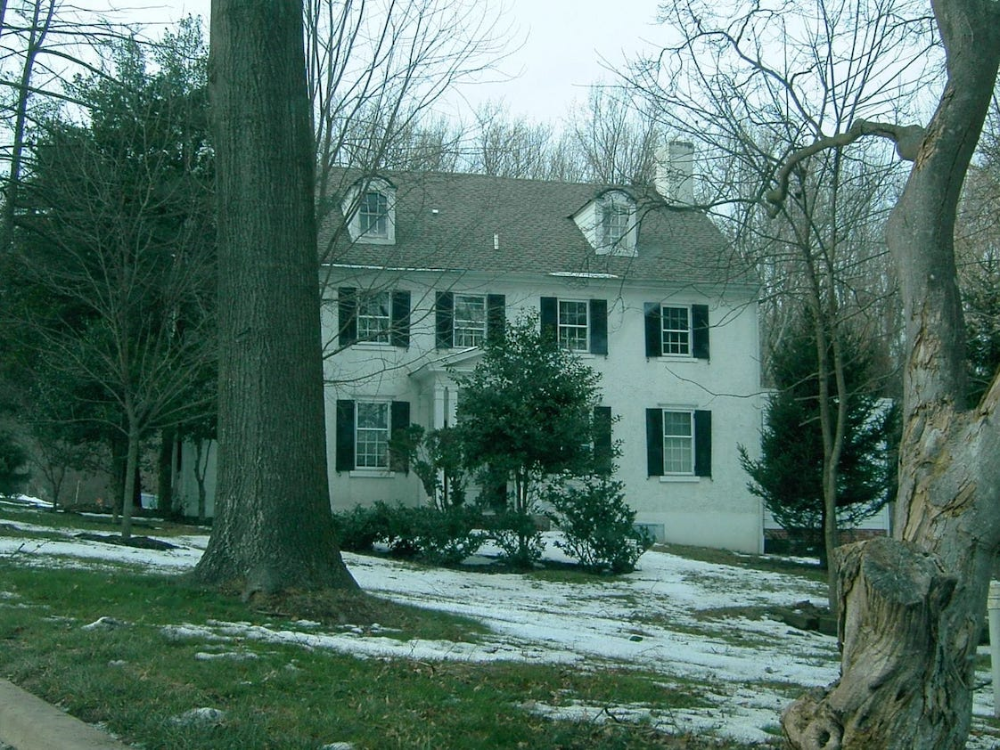
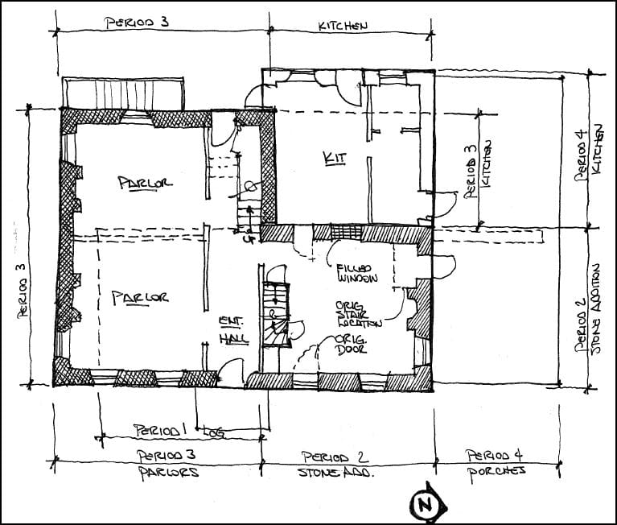
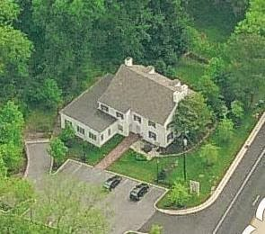
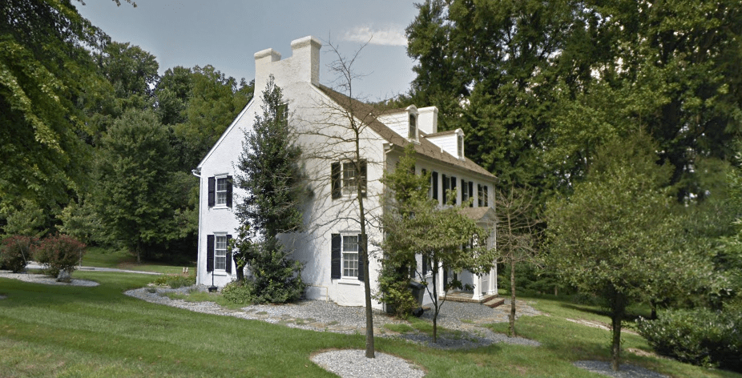

*the Dixon-Jackson house in Delaware*

Henry Dixon, son of the immigrant William Dixon, purchased two hundred acres in Mill Creek Hundred in 1726, at the age of 34. He built a one-room log house on his property in what is now northern Delaware. When he passed away in 1742 it was inherited by his son, Samuel Dixon, who later sold it in 1771 before moving to Fayette County in southwest Pennsylvania.

*Dixon-Jackson House Floor Plan*

The Dixons who built and lived in this house:

<iframe width="400" height="804" src="https://www.WikiTree.com/treewidget/Dixon-1143/1" scrolling="no" frameborder="0" marginheight="0" marginwidth="0"></iframe>
*embeddable family tree updated live from WikiTree*

The new owner in 1771, James Jackson, expanded the house at least twice. His son, Thomas Jackson, inherited the home in 1818 and gave the home a final expansion at some point in 1822, removing the remains of the log house from the interior. A later owner added the front porch.

It is currently in use as a Chiropractor/massage therapist office.

*Dixon-Jackson House aerial view*

Current Google Street View screenshot:

*Current Google Street View screenshot of the Dixon-Jackson House*

For more information, visit the [Mill Creek Hundred History Blog](http://mchhistory.blogspot.com/2011/01/dixon-jackson-house.html). You can also read this detailed [Architectural Description and Statement of Significance](../../img/Dixon-Jackson-House.pdf) prepared in 2000 by the Center for Historic Architecture and Design at the University of Delaware.