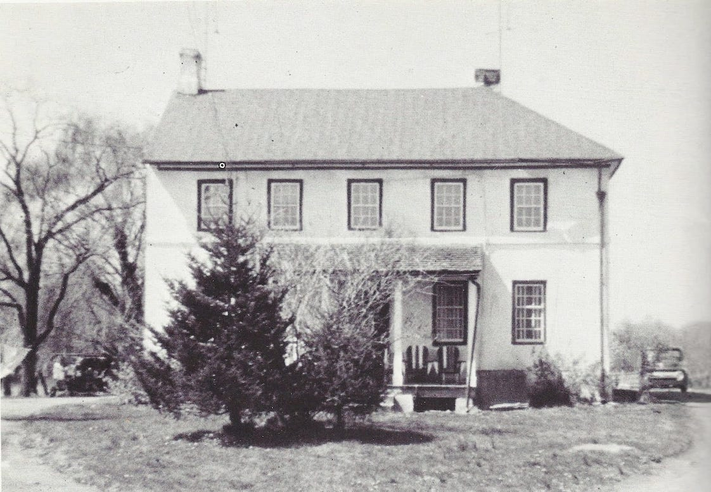

## Dixon-Wilson House

*Dixon-Wilson house, Delaware*

Another son of William Dixon and Ann Gregg Dixon Houghton was John Dixon. John's brother Henry Dixon built the Dixon-Jackson House. John built a home around 1732 west of Henry's home. This home, now known as the Dixon-Wilson House, is on Valley Road southwest of Henry's house.

The home has a datestone inscribed “I & J Dixon – 1732” – The ‘I' being John's son, Isaac Dixon. When John died in 1740 Isaac inherited and lived in the home. When he died in 1766, his son inherited it. When this John died it was inherited by his son, Isaac. Yes, they liked repeating familial names! Finally, when this Isaac died the house was inherited by his oldest son, Jesher. In 1832 Jesher sold the home to the Wilsons, a fellow Quaker family with long ties to the area, and built his own house on Southwood Road, which is also still standing. I will write about that house in a future post…

Here is a partial family tree of the Dixons who lived here:

<iframe width="400" height="804" src="https://www.WikiTree.com/treewidget/Dixon-1159/1" scrolling="no" frameborder="0" marginheight="0" marginwidth="0"></iframe>
*embeddable family tree updated live from WikiTree*