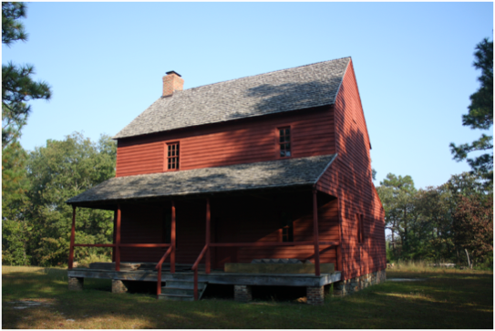

## Jesse Dixon House

Revised 2024-11-26

*Jesse Dixon House, North Carolina*

💡 Originally written by Edwin Patterson - reproduced here since the original site has gone offline. I have done some minor cleanup of typos, added a few notes of correction regarding people and relations, etc.

<video width="400" controls>
<source src="../../../img/jesse-dixon-house.mp4" title="Jesse Dixon House">
</video>

This house, which I have called simply the “Quaker House” for a number of years, has become a major project in my life. I had developed an interest in early buildings in the area about 1981 and had moved the first building, the Huckaby log cabin, to this site in 1983. In 1984, a fellow employee at Weyerhaeuser, Moncure, told me about this house in the country south of Siler City. He had been given some wide boards from the house, had taken pictures, and brought me some nails from the boards. I knew the house looked early, earlier than the cut nails from the interior paneling boards indicated.

It was some time before I got to visit the house. With its massive fireplace, exposed beams, and trim remnants I knew we were on to something special, but I had no idea of just what I was looking at. Research into the architectural style and the location yielded several interesting facts. The style was Pennsylvania German. The interior fireplace, rat-tail strap hinges, finely crafted doors, and attic constructions were features not present on English and Scottish styled housed in the region. The house sat in the heart of what was a thriving Quaker settlement in the late 18th century. The community, know as Napton, was centered just north of the present community of Mt. Vernon Springs. The old cemetery and a foundation for an early school were located about one half mile east of the house. A springhouse had once stood just south of the dwelling, and the remains of a rock dam, probably for a gristmill, is also on the property just south of the house.

The house had never been wired or plumbed, and was in a sad state of disrepair when I first looked at it. The first floor timbers and flooring had collapsed into a rock-lined cellar; sheets of tin had blown off the roof some years before, and all the window sash had been destroyed. Rot and insects were taking their toll; the house was home to a hive of honeybees and a nest of hornets. Termites had long since left the riddled shells of massive sills and framing timbers.

Nonetheless, I knew the house was interesting and went off searching for information about its past. As it turned out, the records concerning the property predated the formation of Chatham County. The trail led to Orange County, from which Chatham was formed in 1771. Surprisingly, both early will and deed records existed regarding the property. The house sat on a portion of a rectangular shaped 520-acre grant issued in 1756 to a man named John May. He sold the northwest portion of the grant to his son in 1758, but ended up taking in back. He resold the parcel to Joseph Dixon in 1766, but the deed was not recorded until 1768. (Joseph was an uncle of Simon Dixon, who moved from Pennsylvania to the Snow Camp area of Guilford County in 1751.) NOTE: Joseph and Simon were cousins, sharing the grandfather William, the immigrant

Joseph authored a will in late 1769 that was probated in early 1770 in which he left this tract to son, Jesse Dixon. (This was not his “home” tract, which he left to wife, Mary.) These people were Quakers, and Napton remained a part of the Cane Creek Meeting in the Snow Camp Area. Jesse was disowned in 1773 for marrying “out of union” to a non-Quaker. Her name was Lydia Winters, and by the 1790 U.S. census, she had borne 7 of their 9 children. Jesse and family joined the slow migration of neighbors moving to the “free lands” opening up in the upper Midwest, and they moved to Ross County, Ohio in 1803.

On 10 Jun 1769, John MAY, Sr. & Mary, his wife, of Orange County, North Carolina, sold to Joseph DIXON, 80 acres on Tick Creek, adjacent George DIXON.
This deed was prefaced by "Whereas John MAY by virtue of an indenture executed by John MAY, Sr. dated 11 Apr 1766 became owner of a tract in Orange containing 100 acres conveyed to John MAY, Jr. by John MAY, Sr. by deed dated 16 Aug 1760 which tract is part of 520 acres from Granville to John MAY, Sr. 13 Feb 1756, Now this indenture." - signed: John JM MAY, Mary X MAY, witnessed by Jacob BROOKS, Caleb DIXON, William GREAVES, proved by BROOKS Jul Term 1769.
The house was certainly built during this 33 year period of ownership by Jesse Dixon, but there is no evidence as to just when. The architectural evidence of pure Pennsylvania styling and possible imported items from there, like the “rat-tail” hinges, and the circumstantial evidence, like his marrying in 1772 or ’73, hint of an early build date in the 1770’s. On the other hand, the scale of the house suggests the means of an established man, and it could have been a second residence built in the 1780’s or ‘90s.

Whatever the case, Jesse’s brother-in-law NOTE: his cousin's son - Simon's father, Thomas, married Phoebe Dixon, another grandchild of William Dixon, Simon Rubottom, consummated the deed for the property in 1808, although he may have lived in the house from the time Jesse had left some 5 years before. Simon stayed until 1815 when his wife and 14 children joined the migration into the upper Midwest. In that year Rubottom transferred the property to his brother-in-law, Samuel Dowd. A diary exists in which a member of the wagon train that made the trek to Ohio chronicled the journey. The trip began 2 weeks after Rubottom sold the property to Dowd and took 6 weeks to finish.

Samuel Dowd was a son of Conner Dowd, who had risen to local prominence as a fierce loyalist during the Revolutionary War in the Carbonton area of what is not Lee County. Samuel married Hannah Rubottom and raised a large family in the house. Architectural evidence suggest tat he, shortly after buying the property, probably added the one story rear shed rooms with adjoining kitchen wing, and the one story front porch.

Note: An interesting sideline for me has been the fact that I discovered that Sam Dowd is an ancestor of mine on my mother’s side, so the man who bought the house in 1815 was my great-great-great-great- grandfather. Samuel Dowd died in 1853 and left the house and land to his youngest son, Horace Quincy Dowd. Horace was a hat maker and shows up repeatedly in Branson’s Business Directory in the latter 1800’s. The property stayed in the Dowd family until 1935, but the Moore family, the last related members living in the house, had moved to Mebane about 1920. Mrs. Leda Moore Taylor, who still resides in Mebane, was born in the house in 1910. The Bruton family bought the property in 1935, and his daughter and her husband, Willis Wrenn, remain the current owners. After visiting the house several times in 1984, I approached Willis Wrenn about buying the house. My intent was to dismantle the house and reconstruct it in Harnett County. Restoring the house at the original site was out of the question; it was about a mile off the road in a pasture at the end of an often-muddy road. Termites had destroyed the lower timbers of the house, and the chimney was so decayed that it could be moved with one hand. The Wrenns were at first reluctant to sell, but they knew the house was only going to rot down if left alone. I committed to put the house back up and not part it out of the beams and boards.

The reasons that I could commit to taking the house down were twofold. First of all, I was working shift work at Weyerhaeuser with a friend, Greg Talbott. Greg shared my interest in old buildings and enjoyed a challenge as much as I did. His advantages were that he was a lot bigger and stronger than I was, and he wasn’t afraid of heights. Secondly, my dad and brother were farmers, so they owned the trucks, trailers, and tractors that could help take the timbers down and haul them to Harnett County, With Greg’s commitment and help, and my pilfering equipment every other week, we had the house down in less than six months. It was a lot of hard dirty work, but it was one of the most satisfying times in my life.

After moving and storing several truckloads of good to not-so-good timbers and lumber, over 5,000 brick, and thousands of pounds of rock, the project sat dormant for years. I didn’t really get back in reconstructing the house until the spring of 1994. The next year was spent laying the stone foundation and installing the sills, floor joists, and subfloor. After repairing many of the main timbers, and recutting many more, we erected the six main posts and the six-second floor plates in September of 1995. I had envisioned hundreds of times how this could be accomplished, but there’s always that bit of doubt regarding such a new and risky venture. It was even more risky considering the whole crew of family and friends that did it had no construction experience, and we did it with a farm tractor and a homemade boom. Amazingly, it went according to plan, and no one got hurt. That was an emotional day for me. I sat out in front of the site until dark staring at those posts standing 20’ in the air and thought to myself, “This project is a GO! We’re going to finally make it happen after 10 years of waiting.” The rest has been no less satisfying, and, given continued health and well-being, it will be finished.

Architectural Features 
The most striking single feature of the Dixon-Dowd house is its scale; it was a large house in central North Carolina when it was built. The second most noticeable feature is the overall quality of construction; it is a finely crafted house that was meticulously fitted together. Immigrants brought both characteristics from Pennsylvania. The Dixons were not German, but they had been exposed to their tradition in that colony of building full two story housed with massive post and beam construction. Most houses in the “wilderness” of North Carolina were simple one or two room houses with an attic. “Story and one Half” construction was prevalent among English and Scottish settlers, and log construction was probably more common than framed structures.

Other details evident in the house suggest Pennsylvania building traditions. The house had a cellar with finely crafted stone foundation. A wind vent, or vertical slit, was located in the eastern end of the foundation; this feature is often seen in the walls of massive stone barns that still exist in Pennsylvania. (I did not reproduce the vent in the new foundation.) The wooden grill in the front foundation wall is a reproduction of the original. These were common on houses of this period built in North Carolina. A springhouse had been located just south of the dwelling at its original site. The foundation still exists. The building was approximately 12’ x 14’, and had steps at one end leading down to the spring that the building once covered. Other springhouses were said to have existed in the Napton area, and they were commonly constructed in Pennsylvania.

The floor plan of the house follows the directions suggested by William Penn in the early days of the colony; that is to build a house “with two thirds at one end forming the hall and the other end divided into two smaller rooms for sleeping.” This three-room plan is repeated on the second floor. The large fireplace in the hall once served as the center for cooking for the household. The fireplace opening is 7 feet across. A wooden pole was mounted crosswise in the chimney opening from which irons for pots were hung; a cooking crane was probably once mounted on the other side of the firebox wall. Normally, the main fire would have burned in the center of the fireplace, and hot coals would have been dragged to either side for heating pots and pans.

A 12” square oak beam serves as the lintel, or support for the brickwork above the fireplace opening. This is the only oak used in the house; the rest of the wood is pine. Iron was a scarce commodity in colonial times, and it was not available in a big enough piece to support the brickwork; hence, the oak support.

The brick for the fireplace were probably produced locally. The opening for the firebox, as well as the exposed brick on the second floor and the attic came from the original chimney. Notice that the ends of the brick forming the corners of the firebox were made with a bevel so that they fitted evenly when laid with a taper to the back of the fireplace.

Most of the timbers for the house were sawed on a “sash saw,” or water powered saw with reciprocating straight saw blades. The even, straight saw marks are evident on all timbers of the house except for the two upper plates in the side-walls and the two purloins n the attic. These four timbers run full 32’6” length of the house and were hewn. Undoubtedly, the saw carriage at the mill could not handle timbers this long.

The support timbers in the attic are known as a “principal rafter support” system. I do not know of the existence of another house in North Carolina built with this system. The feature is so named because a pair of principal, or heavy rafters, are installed two thirds of the distance from the chimney end of the house and over the interior wall, which has a load bearing support post. These principal rafters in turn support purloins which are tenoned into the end rafters and act as supports for the remaining interior rafters. This has the advantage of leaving the attic open for head space because cross braces, or “ wind beams” for the rafters are not needed. The doors for the front and back are original. Notice the quality of their construction. The strap hinges for the back door are original; the finely tapered, wavy ends are known as “serpentine” or “rat tail” tips. These are definitely Pennsylvania German and may have been made there. The hinges on the front door are copies, as is the door latch, but they match the “ghost prints” of these items that were on the door. Jerry Darnel, well-known black smith from the Jugtown area, made them.

The red paint on the front door is the oldest paint found on the house, and traces of this color were also found on the window casements. We have matched this color as closely as possible with new paint we used on the entire exterior. The back door was repainted in Spanish brown, another popular color in colonial times. The Georgian mantel for the shed room fireplace, which was added about 1815, was also done in this color.

What I have wanted to convey is that the house is an early example for Central North Carolina, that it is a pure architectural style, that it is a wonderful statement of the abilities and teamwork of the people who built it, and that it has become a labor of love trying to put it back the way it was. It is repeating, for me, the aspect of teamwork, for the project had created friends and brought friends together for this, the second constructions.

Thank you so very much.