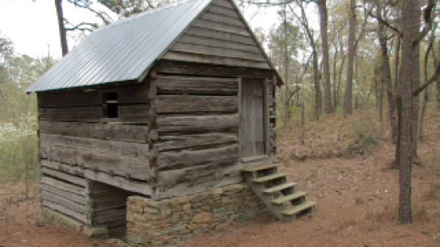
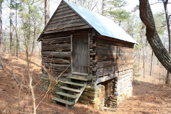
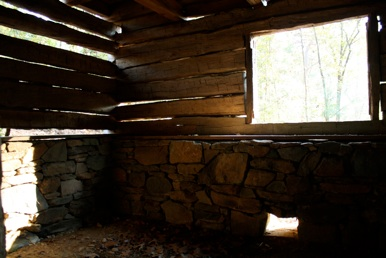
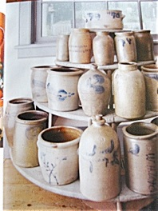

## Nathan Dixon Spring House

Nathan Dixon spring house

💡 Originally written by Edwin Patterson - reproduced here since the original site has gone offline. I have done some minor cleanup of typos, added a few notes of correction regarding people and relations, etc.

<video width="400" controls>
<source src="../../../img/nathan-dixon-house.mp4" title="Jesse Dixon House">
</video>

This Springhouse was built around 1789. It is hard to get an exact date because a lot of recycled wood was used to build it. The owner, Nathan Dixon, was the brother of Jesse Dixon, who lived in the Quaker House.

It is very likely that since Jesse Dixon had a sawmill on his property he cut the wood for his brother and they hauled it over to where this springhouse was built. (Which was only about a mile away)

There was originally a log cabin adjoining the springhouse that was destroyed. It was probably Nathan’s early home.

)

### The Purpose of a Springhouse 

A Spring house, or springhouse, is a small building used for refrigeration, once commonly found in rural areas before the advent of electric refrigeration. it is usually a one-room building constructed over the source of a spring. This particular spring house is more elaborate than most.

You would keep the spring itself cleaned out so that you could just dip your water out of it. The water would then flow down and flood the lower end and keep it cool so you could either put your diary products and food that needed to be preserved on the rock ledge which served as a cool sink or your could put your dairy crocks in the cool water.

The water of the spring maintains a constant cool temperature inside the spring house throughout the year. in settings where no natural spring is available, another source of natural running water, such as a small creek or diverted portion of a larger creek, may be used.