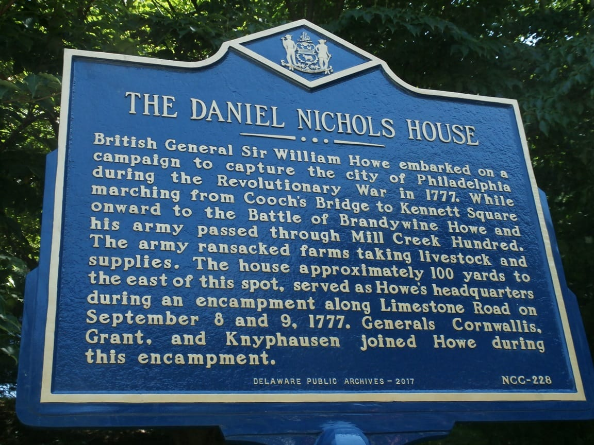

*Nichols house, Delaware*

This house is tied to other Dixon homes in the area, and had some interesting ties to historical events in the Revolutionary War, as mentioned in the historical marker above.

When [John Dixon](https://www.wikitree.com/wiki/Dixon-350), builder of the [Dixon-Wilson house](../Houses/Dixon-Wilson%20House.md) on Valley Road, passed away, his widow [Sarah Hollingsworth Dixon](https://www.wikitree.com/wiki/Hollingsworth-1343) married another Quaker, [Daniel Nichols](https://www.wikitree.com/wiki/Nichols-3061), in 1743. Her oldest son, [Isaac](https://www.wikitree.com/wiki/Dixon-1159), later married Daniel's younger sister, [Ann Nichols](https://www.wikitree.com/wiki/Nichols-2815), and they lived in the Dixon-Wilson House while their son [Jehu](https://www.wikitree.com/wiki/Dixon-1163) went on to build the Samuel P. Dixon House near Red Clay Creek. Later still, when Daniel Nichols died in 1798, Isaac and Ann's son, Thomas, inherited the Nichols House. (Thomas married a Sarah Cooper, unverified)

In 1822 it was sold to Thomas Dixon, Jr., then in 1842 to a cousin, [Wistar T. Dixon](https://www.wikitree.com/wiki/Dixon-11646). As far as anyone can tell the house no longer exists.

You can read here about [how the house was rediscovered](https://mchhistory.blogspot.com/2017/08/finding-nichols-house-part-i-british.html) and also [how the house was rediscovered, part two](https://mchhistory.blogspot.com/2017/08/finding-nichols-house-part-ii-where.html).