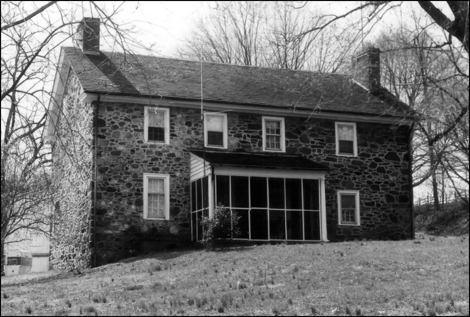
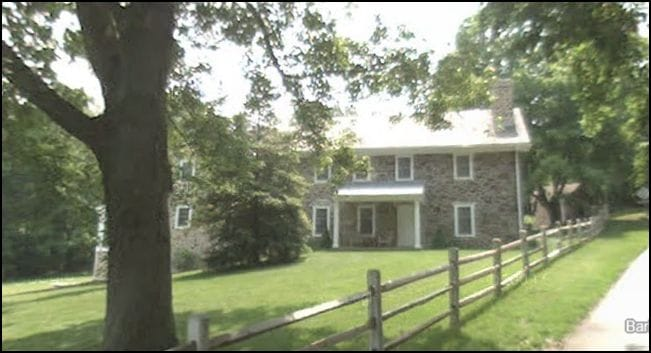
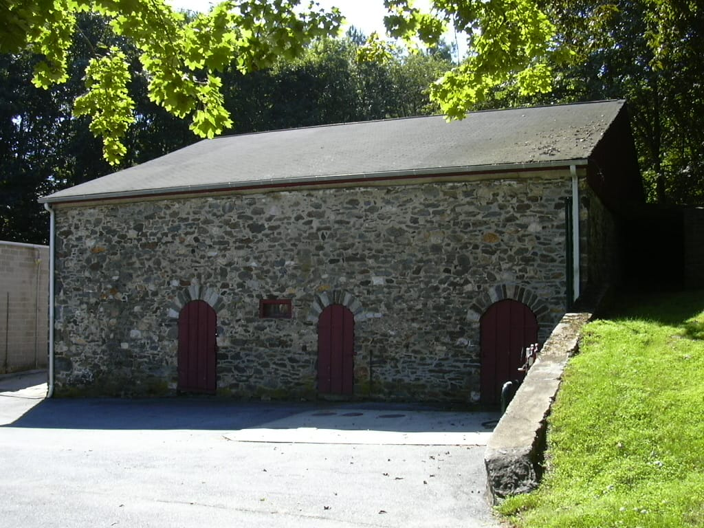
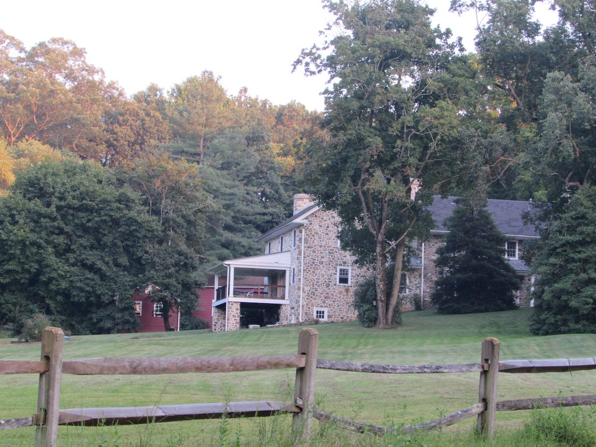

*Samuel P Dixon house, Delaware*

In 1791 [Jehu Dixon](https://www.wikitree.com/wiki/Dixon-1163), son of [Isaac Dixon](https://www.wikitree.com/wiki/Dixon-1159), built a fieldstone house in the eastern part of Mill Creek Hundred. After his death it eventually went to his son, [Samuel P. Dixon](https://www.wikitree.com/wiki/Dixon-1164) who lived there until his death in 1879. He expanded the home and added a fieldstone barn and a springhouse.

 

*Samuel P Dixon House, Delaware*

Eventually his son, [Samuel C. Dixon](https://www.wikitree.com/wiki/Dixon-1165), owned the property until it passed out of the Dixon family around 1910 or so.

 

*Samuel P Dixon House Barn, Delaware*

This property still stands. You can read more about it on the [Mill Creek Hundred History Blog](http://mchhistory.blogspot.com/2011/09/samuel-p-dixon-house.html). It is also on the National Register of Historic Places.

[The S. P. Dixon Farm](https://en.wikipedia.org/wiki/S.P.DixonFarm)

[The original Historic Places application](https://npgallery.nps.gov/pdfhost/docs/NRHP/Text/86003085.pdf)

All four generations of Dixons who lived here:

<iframe width="700" height="820" src="https://www.WikiTree.com/treewidget/Dixon-1165/3" scrolling="no" frameborder="0" marginheight="0" marginwidth="0"></iframe>
*embeddable family tree updated live from WikiTree*

*Samuel P Dixon House Side View*