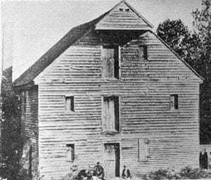

## Dixon's Mill - Cane Creek, North Carolina 

William's grandson Simon Dixon bought land in North Carolina (from the ‘Lords Proprietors’) in 1751. He erected Dixon’s Mill on Cane Creek for corn and/or grain grinding. It was burned and rebuilt many times but always used that creek for water power. In 1925 a millstone from his mill was used as his commemorative gravestone as part of a monument erected by the Alamance County Historical Society. In 1953 a fire destroyed the remaining house and mill and it was purchased by a wealthy citizen of Durham who purportedly disassembled it down to the ground in a search for hidden gold.