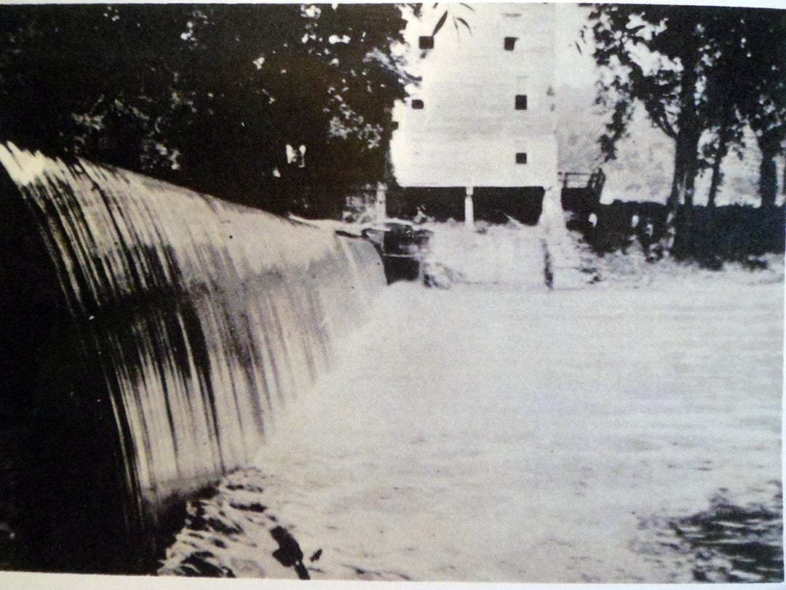
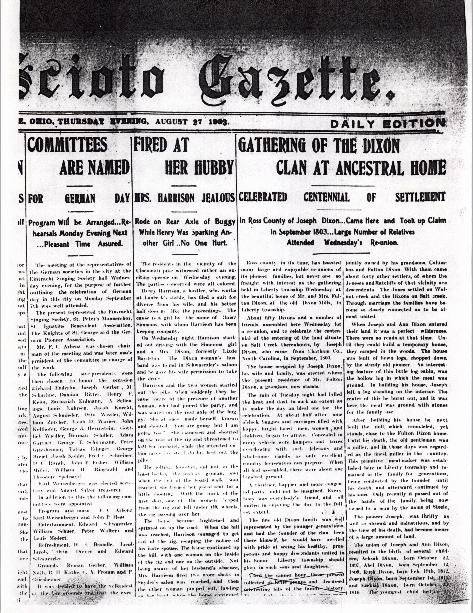
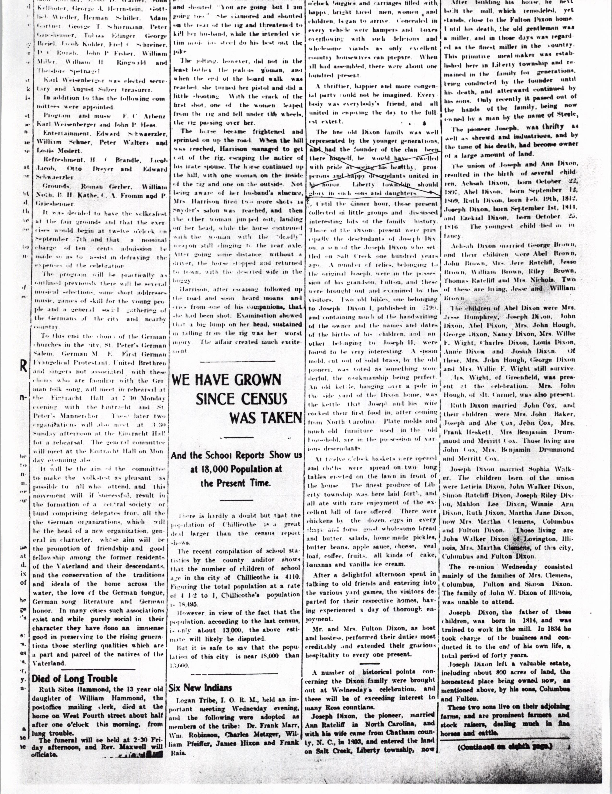
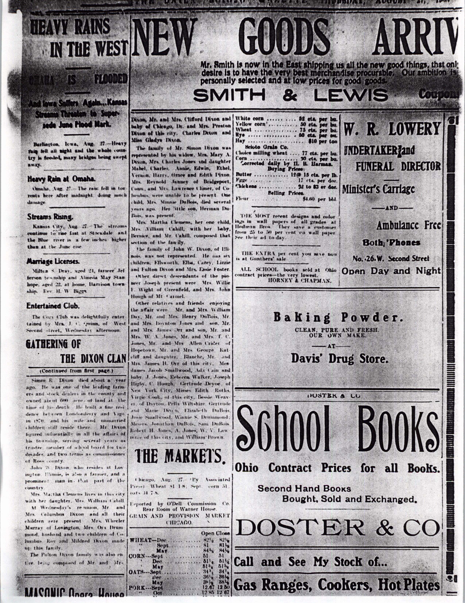

*Dixon Mill - Salt Creek - Londonderry, Ross County, Ohio - photo taken 1908*

- Dixon family reunion covered in the Scioto Gazette, Thursday, August 27, 1903

*Gathering of the Dixon Clan at Ancestral Home*

*Gathering of the Dixon Clan at Ancestral Home (continued)*

*Gathering of the Dixon Clan at Ancestral Home (continued)*

In 1800 the first Dixons moved to the Scioto River Valley of Ohio. Caleb’s three sons Daniel, George and Jonathan moved to Ross County, Liberty Township. Daniel built a mill on the Scioto River and it was still grinding in 1934. Three years later, in 1803 three more Dixons moved to the area – Joseph’s sons [Jesse Dixon](https://www.wikitree.com/wiki/Dixon-1124), [Samuel Dixon](https://www.wikitree.com/wiki/Dixon-1106) (my direct ancestor), and [Joseph Dixon](https://www.wikitree.com/wiki/Dixon-1125). Joseph built a saw and grist mill on Salt Creek which feeds the Scioto River. To this day if you look at a map of Londonderry, Ohio in southeast Ross County you will find, just to the east of town, along a portion of the Salt Creek — Dixon Mill Road. And it is on that road that I found the remains of the old mill. Here are some photos I took in 2011. (click the photo to go to the entire album on Google Photos)

