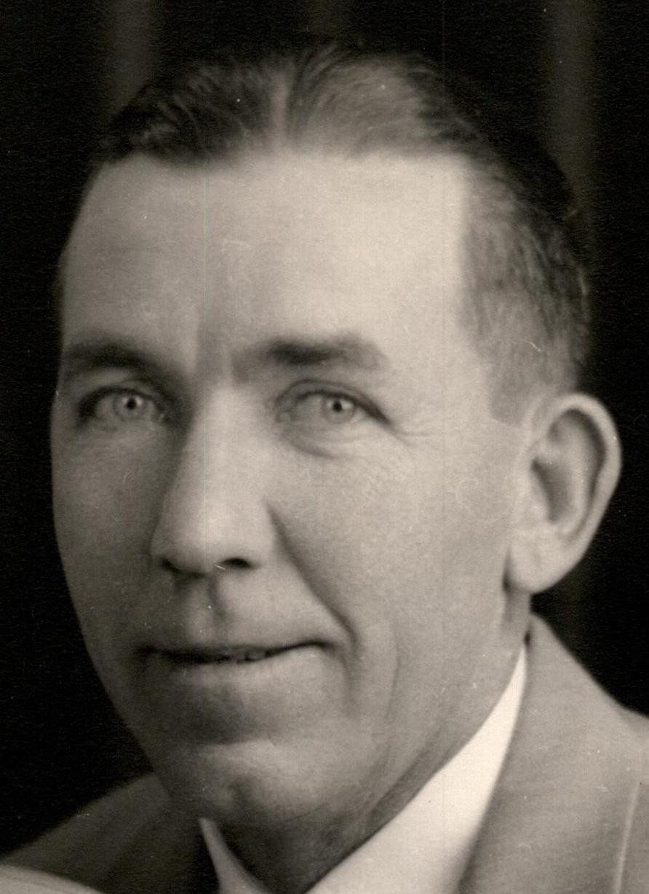
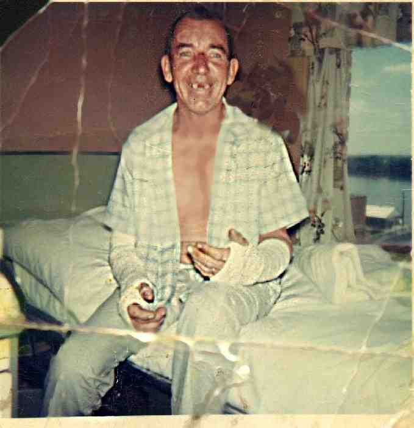
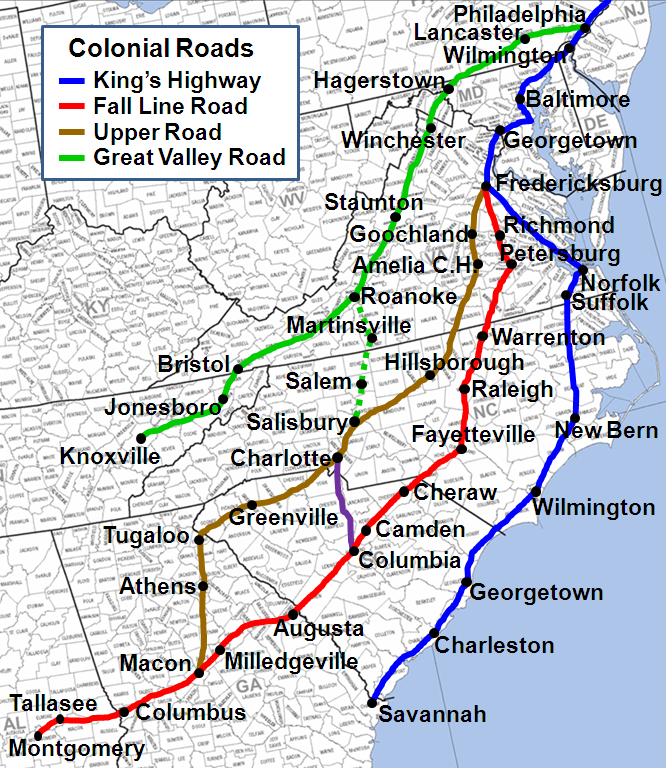
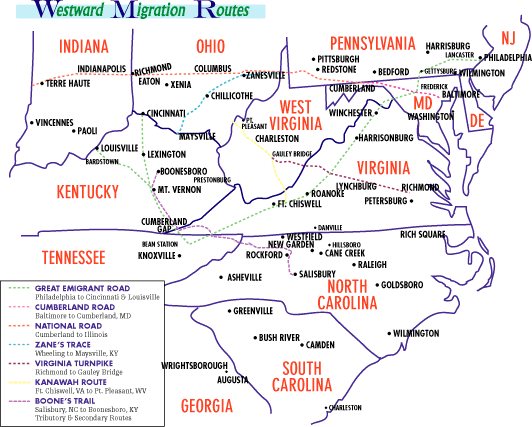

*My great great grandfather, William Cornall, standing in front of a structure*

## Harold Dixon

*Harold Raymond Dixon*

*Harold in the hospital, recovering after falling off of a ladder and breaking both arms. Possibly high on pain meds*

The foundation of this line is my paternal grandfather Harold Dixon. Born in Illinois in 1907, his family moved to Southeast Iowa when he was 13. He married in 1928 and they had their first child three months later! His career was in carpentry, and I learned to play pool in his basement. He is long gone, and I am now 60-something, and every morning, just like he did, I am up before dawn, sitting alone, drinking coffee.

## William, Rose and Dinah Dixon

This line is the one I am most familiar with, stretching back to some of the original Quakers in Ireland.

William Dixon and his two sisters, Rose and Dinah, appeared in the southern part of Penn’s Colony, now northern Delaware, in 1689. These siblings have somewhat [murky origins](Dixon Origins.md) that have greatly resisted attempts to prove or disprove them. The assumption has always been that they came from the Lurgan Monthly Meeting in County Armagh in northern  Ireland, and their connections in the Newark Monthly Meeting to the Hollingsworth and Harlan families provides correlation.

*Colonial Roads in the South*

From each of these siblings thousands of descendants populated the colonies long before the revolution produced a nation. My Dixon line migrated down the King’s Highway to Fredericksburg, Virginia, then took either the Fall Line Road or the Upper Road into the Piedmont regions of North Carolina in the mid-1750’s. They later migrated to the new Northwest Territory to what is now south-central Ohio in the early 1800’s.

*Quaker Migration routes*

Many Dixons and Mendenhalls (through Rose) and Harlans (through Dinah) stayed in the general vicinity of Philadelphia, but many also migrated through the colonies, then later the states.