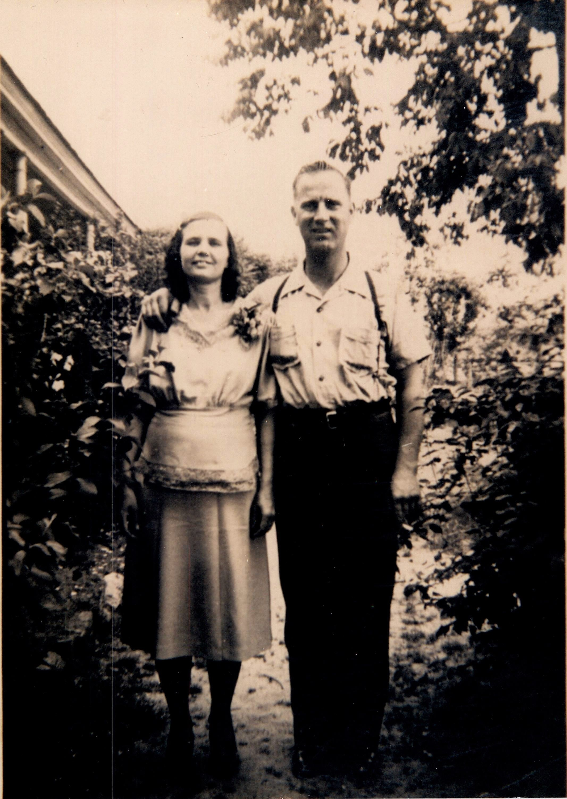

## Celia Lorena Ellis

*David Peterson and Celia Lorena Ellis*

My maternal grandmother was Celia Lorena Ellis. She was born in North Carolina in 1905 and never left Cleveland County, except for one summer when she lived with my parents in Big Lake, Texas. She tried her best to protect her five children from her husband and eventually left once they were grown. Her life was never easy, ever. Cotton defined her life. She and her children were sharecroppers, and later she found steadier work in the cotton mill. Her grandfather, Zenas Alonzo Ellis, was the last in this Ellis family to hold slaves. On her mother’s side of the family, the Allens, her great-grandmother was a Camp. This line goes back to at least 1480 in England, with the family name being present there as far back as 1300.