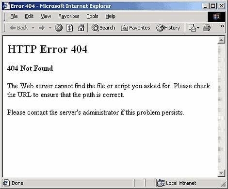

## Fading Memories

[Edited July 1, 2018]

As the self-designated family genealogist I am keenly aware of how quickly the information of past generations can be lost. I am **so** thankful that my mother started interviewing relatives and taking notes when I was just a child. Most of the people she talked to are now dead and gone, bits and pieces of their memories preserved in her notebook. It was her initial investigation that enabled us to contact a distant cousin who was able to connect us to the rest of the family tree going back to 1633. Over the last several years I have been filling in the blanks and connecting the dots, but as most genealogists know for every piece of information you find you usually discover the existence of several other pieces of information which are out of your reach. As an example, I recently connected with a long lost cousin through [DNA testing][1]. Once this was established we began looking for connections from the Dixon Quakers of North Carolina to this person’s oldest known ancestor who died in 1801 in Georgia. In the process I discovered where yet one more branch of Dixons had disappeared to and found several new monthly meetings where Dixons had attended. One such meeting was the Lost Creek MM in eastern Tennessee. I also ran across a book written about this meeting entitled “Lost Creek Memories” by none other than Ben F. Dixon, the author of two major resources for our Dixon line. As it turns out he has authored over 20 books on history, mainly Quaker-related. So now there are an additional 20+ books that I know about but have no way to read as they are mostly out-of-print and are probably collecting dust on a few library shelves.

Now, on top of all that which genealogists have been dealing with for years, no doubt, comes the internet. There are many web pages which I consider to be vital resources. I read them again and again finding new clues. But what if those pages were suddenly gone?

What if the hosting account ended, or the owners passed away? Do I have copies of the information somewhere? And even if **I** have a copy, what about all the other people who might need that information? Thus, I have decided that I need to copy all of these sites **and** republish them on my web site. Normally this would be considered some sort of copyright infringement but when you run across a web site with vital, unique family information and it hasn’t been updated since 1998 you should be scared! So now I have another project.

You can look for these pages here (at some point). All of my other genealogy data is on the [WikiTree][2] site. (that link is to my great-grandfather, Walton Artie Dixon.)

 [1]: https://www.familytreedna.com/groups/dixon-project/about
 [2]: https://www.wikitree.com/wiki/Dixon-1086