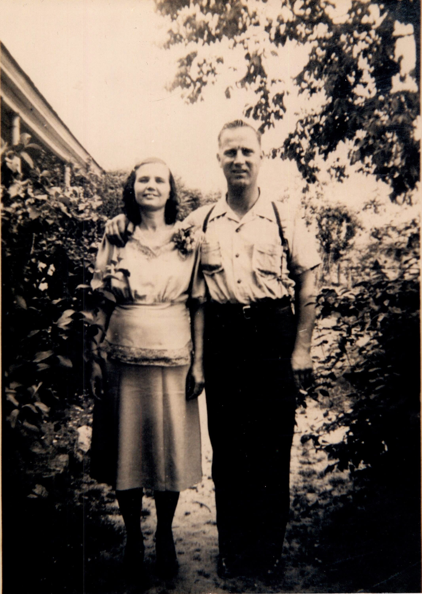

## David Peterson

*David Peterson and Lorena Ellis*

My maternal grandfather David Peterson. He was born in South Carolina in 1910 and lived his life in the vicinity of King’s Mountain, North Carolina. He was an alcoholic and an abuser, yet in spite of that my mother still saw the good in him. His life was never easy and it was often due to his own hand. His father, James Robert Peterson, has very conflicting stories surrounding *his* father. His father was either a McDaniel (per oral tradition) or a Peterson, per his death certificate. His mother was also a Peterson, sister to the Peterson on the death certificate. Further DNA testing is needed to verify the male y-DNA lineage.