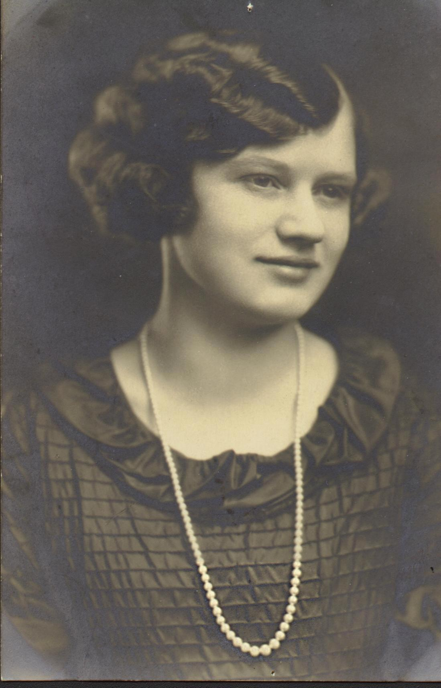

## Flossie Mae Stanley

*Flossie Mae Stanley*

My paternal grandmother Flossie Stanley, born in 1905. The matriarch of the family, maker of butterhorns (a cherished recipe), source of the bottomless cookie jar. She was the glue, the social center for my extended family who mostly stayed in Burlington, Iowa. Need to find who her grandparents were.