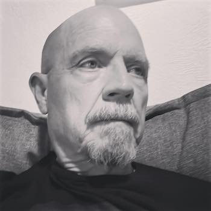

 
*Me in 1961, already looking back*

FYI, I'm a bit older now:

My name is Glenn Dixon, and I have been researching my family history since 1998. I am deeply indebted to my mother, Millie, who used to interview relatives in the late 1950s and early 1960s every time we vacationed in either Iowa or North Carolina. I am also very lucky to have run into Pat Hageman who was managing the Moultrie County, IL USGenWeb site and who graciously sent me paperwork connecting my Paternal family tree from the mid-1800s in Illinois all the way back to the early 1600s in Ireland. Yes, I got very lucky!

Since then I have spent countless hours researching in libraries and court houses nationwide, as well as many trips to cemeteries. I have taken pictures and video in states from Delaware to North Carolina to Iowa and almost everywhere in-between. The places and cemeteries are numerous as my Paternal line (Dixon) has been here in North America since 1689, almost one hundred years before the Declaration of Independence! Several other lines have similar pedigrees.

I have tried several different software programs and web programs over the years, and even though I still haven’t found what I consider to be the perfect or ‘ideal’ way to share my family history with other descendants, [WikiTree](https://wikitree.com) is probably as close as I'm going to get. My oldest known Paternal ancestor is [Henry Dixon](https://www.wikitree.com/wiki/Dixon-347). His three children [William Dixon](https://www.wikitree.com/wiki/Dixon-357), [Dinah Dixon](https://www.wikitree.com/wiki/Dixon-344) and [Rose Dixon](https://www.wikitree.com/wiki/Dixon-353) settled in what is now northern Delaware, then part of Penn's Colony. They were Quakers. I will post other lines shortly.

On my father's side, I am working on Dixon, Stanley and Stidley lines. On my mother's, Peterson, Camp and Ellis. On my wife's paternal side: Rees and Wormer. On her maternal side: Gilmore and Scruggs. Side note: my wife and I are 7th cousins, twice removed through a connection on our maternal sides through the Camp family.

I am cleaning up records and adding a lot of scanned documents and images to WikiTree. Soon I will begin developing more narratives here. I am also beginning the process of logging all of my research, something that definitely belongs here, probably in the news section.

NOTE: I will be regularly updating records and articles here, combining several different recent trends:

* [Digital Garden](https://maggieappleton.com/garden-history)
* [Learning in Public](https://www.swyx.io/learn-in-public/)
* [Evergreen](https://notes.andymatuschak.org/z4SDCZQeRo4xFEQ8H4qrSqd68ucpgE6LU155C)

The main difference you'll see is that many of my articles/essays are works-in-progress (WIP), evolving ideas, revised and updated as needed. Therefore, they will generally not be sorted by publication date, although dates 'planted' and 'tended' are provided. Much of the current content is older, but new thoughts and notes will be added regularly as I uncover new information.